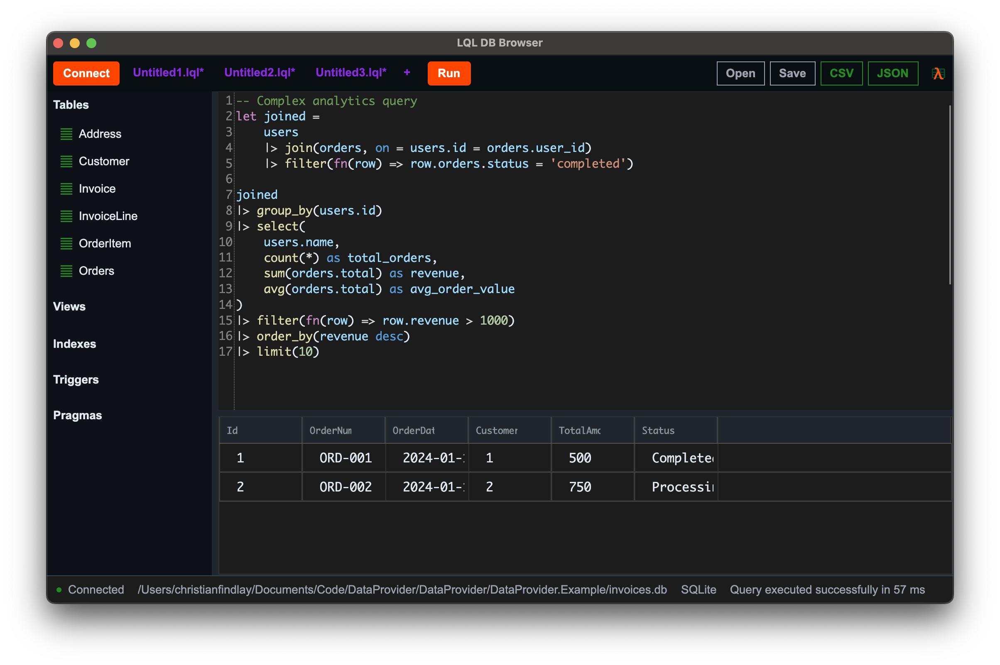

# DataProvider & Lambda Query Language (LQL)

This repository contains two complementary projects that work together to provide compile-time safe database access and a functional query language for .NET applications.

[Try Lambda Query Language live](https://melbournedeveloper.github.io/DataProvider/#playground) in the browser now.

This is what LQL looks like when querying an SQLite database. App source [here](Lql/Lql.Browser).




## Aims

This project delivers compile-time safe, high-performance data access inspired by [F# Type Providers](https://learn.microsoft.com/en-us/dotnet/fsharp/tutorials/type-providers/) like [SQLProvider](https://fsprojects.github.io/SQLProvider/). It solves the fundamental problems with existing ORMs through two complementary approaches.

### The Problems With Current Popular Data Access Approaches

#### Dapper
Runtime reflection means no compile-time type checking, no nullability guarantees, and potential incompatibility with AOT.

#### Entity Framework
LINQ expressions can't express complex queries like SQL can. It also gives you poor query optimization control.

#### Query Objects (Common in CQRS Systems)
The most common problem is with the object-based query pattern popular in CQRS architectures. They usually start simple but accumulate business logic, filters, includes, and special cases over years until they're incomprehensible. 

Each developer adds their own fragment without understanding the whole, creating queries that no one fully understands and nobody can refactor. The abstraction that was meant to simplify queries becomes more complex than the SQL it was trying to hide. 

For example, this kind of query object is common in .NET codebases. The person looking at this code has no context of what the fields mean, or how these will be converted to SQL at runtime. 

```csharp
public class GetInvoicesQuery : IQuery<List<InvoiceDto>>
  {
      public int? CustomerId { get; set; }
      public DateTime? StartDate { get; set; }
      public DateTime? EndDate { get; set; }
      public bool? IsPaid { get; set; }
      public bool IncludeDeleted { get; set; }
      public decimal? MinAmount { get; set; }
      public decimal? MaxAmount { get; set; }
      public List<int> ExcludedCustomerIds { get; set; } = new();
      public bool OnlyOverdue { get; set; }
      public int? DaysOverdue { get; set; }
      public bool IncludeLineItems { get; set; }
      public bool IncludeCustomerDetails { get; set; }
      public bool ApplyLegacyDiscounts { get; set; }
      public string? Region { get; set; }
      public bool ExcludeDisputed { get; set; }
      public bool OnlyRecurring { get; set; }
      public List<string> ProductCodes { get; set; } = new();
      public bool GroupByCustomer { get; set; }
      public bool IncludePendingApproval { get; set; }
      public int? SalesRepId { get; set; }
      public bool ApplySpecialPricingRules { get; set; }
      public DateTime? SpecialPricingCutoffDate { get; set; }
      public bool ExcludeTestAccounts { get; set; }
      public bool OnlyWithCreditNotes { get; set; }
      public bool UseFiscalYearDates { get; set; }
      public int? FiscalYearOffset { get; set; }
  }
```

### The Solution

DataProvider generates pure C# code at compile time from your queries. There is no reflection. It fully supports AOT and null safety with nullable reference types. It has raw ADO.NET performance. Your queries are type-checked during compilation, which catches errors before deployment, just like EF.

LQL (Lambda Query Language) complements this by providing a functional pipeline syntax that transpiles to native SQL. Instead of archaic procedural SQL (T-SQL, PL/pgSQL), you write queries with lambda expressions and pipeline operators that feel natural to C# developers, and allow for complex business logic in triggers and functions.

LQL enables portable queries across databases while still allowing platform-specific SQL when needed or preferred. You can express triggers, functions, and stored procedures in maintainable, FP style code that transpiles to your database's native procedural SQL, or C# in the case of SQLite.

Together, they provide:
- Portability of querying and business logic at the database level with a well-designed FP style language
- Generate compile-time safe C# methods from either source
- Full control over SQL optimization with complete type safety

In other words, you can just write simple queries with SQL or LQL and get the same kind of compile-time safety that EF provides.

## Projects Overview

### 1. DataProvider
A source generator that creates compile-time safe extension methods for database operations from SQL files. It generates strongly-typed C# code based on your SQL queries and database schema, ensuring type safety and eliminating runtime SQL errors.

**Key Features:**
- Compile-time SQL validation
- Auto-generated extension methods on `IDbConnection` and `IDbTransaction`
- Support for SQLite and SQL Server
- Schema inspection and code generation
- Result type pattern for error handling

[View DataProvider Documentation →](./DataProvider/README.md)

### 2. Lambda Query Language (LQL)
A functional pipeline-style DSL that transpiles to SQL. LQL provides a more intuitive and composable way to write database queries using lambda expressions and pipeline operators.

**Key Features:**
- Functional pipeline syntax using `|>` operator
- Lambda expressions for filtering and transformations
- Cross-database support (PostgreSQL, SQLite, SQL Server)
- VS Code extension with syntax highlighting
- CLI tools for transpilation

[View LQL Documentation →](./Lql/README.md)

## How They Work Together

DataProvider and LQL integrate seamlessly:

1. **Write queries in LQL** - Use the intuitive pipeline syntax to express your database queries
2. **Transpile to SQL** - LQL files (`.lql`) are automatically converted to SQL files
3. **Generate type-safe code** - DataProvider source generators create extension methods from the SQL
4. **Use in your application** - Call the generated methods with full IntelliSense and compile-time safety

### Example Workflow

```lql
// GetCustomers.lql
Customer
|> join(Address, on = Customer.Id = Address.CustomerId)
|> filter(fn(row) => row.Customer.IsActive = true)
|> select(Customer.Id, Customer.Name, Address.City)
```

This LQL query gets transpiled to SQL and DataProvider generates:

```csharp
// Auto-generated extension method
var customers = await connection.GetCustomersAsync(cancellationToken);
```

## Getting Started

### Prerequisites
- .NET 8.0 or later
- Visual Studio 2022 or VS Code
- Database (SQLite, SQL Server, or PostgreSQL)

### Installation

1. Clone the repository:
```bash
git clone https://github.com/MelbourneDeveloper/DataProvider.git
```

2. Build the solution:
```bash
dotnet build DataProvider.sln
```

3. Run tests:
```bash
dotnet test
```

## Repository Structure

```
DataProvider/
├── DataProvider/           # Core DataProvider projects
│   ├── DataProvider/       # Core library
│   ├── DataProvider.SQLite/
│   ├── DataProvider.SqlServer/
│   └── DataProvider.Example/
├── Lql/                    # Lambda Query Language projects
│   ├── Lql/                # Core LQL library
│   ├── Lql.SQLite/
│   ├── Lql.SqlServer/
│   ├── Lql.Postgres/
│   ├── LqlCli.SQLite/      # CLI tool
│   └── LqlExtension/       # VS Code extension
└── Other/
    ├── Results/            # Result type implementation
    └── Selecta/            # SQL parsing utilities

```

## License

MIT License - See individual project folders for details.

## Author

MelbourneDeveloper - [ChristianFindlay.com](https://christianfindlay.com)

## Contributing

Contributions are welcome! Please read the contributing guidelines in each project's README before submitting pull requests.